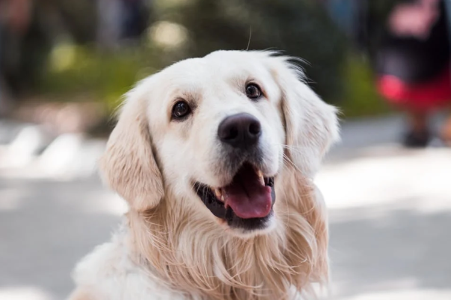

# Dokumentation | erstellte Bilder 
Hier werden alle Bilder welche in der Bachelorarbeit verwendet wurden und selbst von Autor erstellt wurden dokumentiert.
Die Bilder wurden im empirischen Teil der Arbeit bzw. in der quantitativen Umfrage verwendet.

---

| Originalbild                                           | Bezeichnung                     | … | Bild 1                                         | … | Bild 2                                         |
|--------------------------------------------------------|---------------------------------|---|------------------------------------------------|---|------------------------------------------------|
|     | Heißluftballon `F_1.1.1.png` |   |     |   |     |

## 1. Natur

| Originalbild                            | Bezeichnung                        | Link                                                                                                                               | Abrufdatum  | Autor                                                          | Bild 1                                | Erstelldatum  | Prompt                                                                                                                                                                                                                                                                                                                                                                                                                                                                                                                                                        | Link                                                                                                                        | Bild 2                                | Erstelldatum  | Prompt                                                                                                                                                                                                                                                                                                                                                                                                                                                                                                                                                        | Link                                                                                                                        |
|-----------------------------------------|------------------------------------|------------------------------------------------------------------------------------------------------------------------------------|-------------|----------------------------------------------------------------|---------------------------------------|--------------|----------------------------------------------------------------------------------------------------------------------------------------------------------------------------------------------------------------------------------------------------------------------------------------------------------------------------------------------------------------------------------------------------------------------------------------------------------------------------------------------------------------------------------------------------------------|-----------------------------------------------------------------------------------------------------------------------------|---------------------------------------|--------------|----------------------------------------------------------------------------------------------------------------------------------------------------------------------------------------------------------------------------------------------------------------------------------------------------------------------------------------------------------------------------------------------------------------------------------------------------------------------------------------------------------------------------------------------------------------|-----------------------------------------------------------------------------------------------------------------------------|
|     | Heißluftballon `F_1.1.1.png`    | [Link zum Originalbild auf Pexels](https://images.pexels.com/photos/2325447/pexels-photo-2325447.jpeg?auto=compress&cs=tinysrgb&amp;w=1260&amp;h=750&amp;dpr=1) | 17.06.2025  | [Francesco Ungaro](https://www.pexels.com/de-de/@francesco-ungaro/) |   | 17.06.2025   | 

Prompt
A hyper-realistic low-angle 16:9 scene shot from ground level looking up at two striped hot-air balloons rising above a rugged sandstone plateau—foreground shows textured rocky ground and desert grasses blurred at the bottom edge; one balloon filling the upper right frame, another smaller overhead to the left; warm sunrise light casting soft, realistic shadows on the rock faces, subtle atmospheric haze above; ultra-detailed fabric texture and rock surfaces, true-to-life colors and depth, 8K photorealism
 | [Link zum Originalbild auf Midjourney](https://cdn.midjourney.com/df7d2e67-a2fb-4533-9f62-a3ae2bb297a0/0_1.png) |  | 17.06.2025   | 

Prompt
A hyper-realistic low-angle 16:9 scene shot from ground level looking up at two striped hot-air balloons rising above a rugged sandstone plateau—foreground shows textured rocky ground and desert grasses blurred at the bottom edge; one balloon filling the upper right frame, another smaller overhead to the left; warm sunrise light casting soft, realistic shadows on the rock faces, subtle atmospheric haze above; ultra-detailed fabric texture and rock surfaces, true-to-life colors and depth, 8K photorealism
 | [Link zum Originalbild auf Midjourney](https://cdn-midjourney.com/35946f75-43f9-42e8-ae9c-147bd2e8f289/0_2.png) |
|     | Wüste `F_1.2.1.png`             | [Link zum Originalbild auf Pexels](https://images.pexels.com/photos/4568088/pexels-photo-4568088.png)                                                                     | 17.06.2025  | [Hemz](https://www.pexels.com/de-de/@h3mins/)               |   | 17.06.2025   | 

Prompt
A hyper-realistic 16:9 ground-level view of an endless desert of wind-sculpted golden sand dunes—intricate ripple patterns stretching from the foreground to the horizon, a few sparse tufts of desert scrub, pale blue sky above, soft natural light casting gentle shadows in the troughs, ultra-detailed textures on each dune crest, true-to-life colors, 8K photorealism
 | [Link zum Originalbild auf Midjourney](https://cdn-midjourney.com/f38ab05c-4b20-4f50-860c-da08ee610bff/0_0.png) |  | 17.06.2025   | 

Prompt
A hyper-realistic 16:9 ground-level view of an endless desert of wind-sculpted golden sand dunes—intricate ripple patterns stretching from the foreground to the horizon, a few sparse tufts of desert scrub, pale blue sky above, soft natural light casting gentle shadows in the troughs, ultra-detailed textures on each dune crest, true-to-life colors, 8K photorealism
 | [Link zum Originalbild auf Midjourney](https://cdn-midjourney.com/03dcfac7-8a2f-4e85-a64e-05c56f5f8759/0_2.png) |
|     | Palme `F_1.3.1.png`             | [Link zum Originalbild auf Pexels](https://images.pexels.com/photos/240526/pexels-photo-240526.jpeg?_gl=1*1lxt5pu*_ga*MzIwMjE4NzI5LjE3NTAwNTc5NDc.*_ga_8JE65Q40S6*czE3NTA0OTM5OTAkbzExJGcxJHQxNzUwNDk0NDA0JGo4JGwwJGgw) | 21.06.2025  | [Asad Photo Maldives](https://www.pexels.com/de-de/@asadphoto/) |   | 21.06.2025   | 

Prompt
Tropical beach with pristine white sand and crystal-clear turquoise water, a single tall coconut palm tree leaning gracefully over the shore, vibrant green fronds backlit by a deep blue sky with a few wispy clouds, lush tropical foliage at the edges, soft natural sunlight, tranquil and inviting atmosphere, photorealistic, ultra-high detail, 8K
 | [Link zum Originalbild auf Midjourney](https://cdn-midjourney.com/6d26202b-f0c7-4d6a-804c-71524306f373/0_2.png) |  | 21.06.2025   | 

Prompt
Tropical beach with pristine white sand and crystal-clear turquoise water, a single tall coconut palm tree leaning gracefully over the shore, vibrant green fronds backlit by a deep blue sky with a few wispy clouds, lush tropical foliage at the edges, soft natural sunlight, tranquil and inviting atmosphere, photorealistic, ultra-high detail, 8K
 | [Link zum Originalbild auf Midjourney](https://cdn-midjourney.com/9ad38944-3589-40c4-9438-c43701d67799/0_2.png) |

## 2. Tiere

| Bezeichnung      | Bild 1 (intern)                       | Datum       | Autor (extern)                                                         | Links | Bild 2 (intern)                       | Datum       | Prompt                                                                                                                                                                                                                                                                                                                                                                                                                                                                                                                                                        | Links | Bild 3 (intern)                       | Datum       | Prompt                                                                                                                                                                                                                                                                                                                                                                                                                                                                                                                                                      | Links |
|------------------|---------------------------------------|-------------|-------------------------------------------------------------------------|-------|---------------------------------------|-------------|---------------------------------------------------------------------------------------------------------------------------------------------------------------------------------------------------------------------------------------------------------------------------------------------------------------------------------------------------------------------------------------------------------------------------------------------------------------------------------------------------------------------------------------------------------------|-------|---------------------------------------|-------------|-------------------------------------------------------------------------------------------------------------------------------------------------------------------------------------------------------------------------------------------------------------------------------------------------------------------------------------------------------------------------------------------------------------------------------------------------------------------------------------------------------------------------------------------------------------|-------|
| **2.1 Giraffe**  |   | 16.06.2025  | [Pixabay](https://www.pexels.com/de-de/@pixabay/)                       | [Links](https://images.pexels.com/photos/67552/giraffe-tall-mammal-africa-67552.jpeg?auto=compress&cs=tinysrgb&amp;w=1260&amp;h=750&amp;dpr=1) |   | 16.06.2025  | 

Prompt
Majestic giraffe walking across the golden African savannah, side profile view, long spotted neck stretching up toward a soft cloudy sky, dry grasses in the foreground, distant flat horizon, natural warm daylight, shallow depth of field, cinematic wildlife photography style, telephoto 200 mm lens look, ultra-realistic, high detail, 8K
 | [Links](https://cdn.midjourney.com/baae3b8b-a2e1-4f1b-aa92-0ed34ae02c37/0_3.png) |   | 17.06.2025  | 

Prompt
Majestic giraffe walking across the golden African savannah, side profile view, long spotted neck stretching up toward a soft cloudy sky, dry grasses in the foreground, distant flat horizon, natural warm daylight, shallow depth of field, cinematic wildlife photography style, telephoto 200 mm lens look, ultra-realistic, high detail, 8K
 | [Links](https://cdn.midjourney.com/baae3b8b-a2e1-4f1b-aa92-0ed34ae02c37/0_1.png) |
| **2.2 Hund**     |   | 16.06.2025  | [Svetozar Milashevich](https://www.pexels.com/de-de/@svetozar-milashevich-99573/) | [Links](https://images.pexels.com/photos/1490908/pexels-photo-1490908.jpeg?auto=compress&cs=tinysrgb&amp;w=1260&amp;h=750&amp;dpr=1) |   | 16.06.2025  | 

Prompt
Happy golden retriever portrait, warm creamy-golden coat, looking up with joyful expression, mouth open and tongue slightly out, outdoors with soft bokeh background hinting at people walking in a park, natural soft lighting, cinematic pet photography style, ultra-realistic, high detail, shallow depth of field, 85 mm lens, 8K
 | [Links](https://cdn.midjourney.com/f12b8df7-8389-4612-ae5a-fc8b58ce7deb/0_0.png) |   | 17.06.2025  | 

Prompt
Golden retriever portrait, warm creamy-golden coat, looking up, outdoors with soft bokeh background hinting at people walking in a park, natural soft lighting, cinematic pet photography style, ultra-realistic, high detail, shallow depth of field, 85 mm lens, 8K
 | [Links](https://cdn.midjourney.com/b08c6414-aff2-46a9-846e-0e35532d3b24/0_2.png) |
| **2.3 Katze**    |   | 16.06.2025  | [EVG Kowalievska](https://www.pexels.com/de-de/@kowalievska/)            | [Links](https://images.pexels.com/photos/1170986/pexels-photo-1170986.jpeg?auto=compress&cs=tinysrgb&amp;w=1260&amp;h=750&amp;dpr=1) |   | 16.06.2025  | 

Prompt
Orange tabby cat sitting on a rustic wooden windowsill, medium shot with more of the room and window visible, no close-up, warm natural daylight illuminating its striped fur and green-gold eyes, soft bokeh cityscape background, cinematic pet portrait style, ultra-realistic, high detail, shallow depth of field, 85 mm lens look, 8K
 | [Links](https://cdn.midjourney.com/f23a4876-0110-4bfd-9df8-516312a8f9e7/0_1.png) |   | 17.06.2025  | 

Prompt
Orange tabby cat sitting on a rustic wooden windowsill, medium shot with more of the room and window visible, no close-up, warm natural daylight illuminating its striped fur and green-gold eyes, soft bokeh cityscape background, cinematic pet portrait style, ultra-realistic, high detail, shallow depth of field, 85 mm lens look, 8K
 | [Links](https://cdn.midjourney.com/cf269535-0088-4579-acf6-bcaed5bfa53d/0_3.png) |

---

## 3. Autos

| Bezeichnung           | Bild 1 (intern)                       | Datum       | Autor (extern)                                                         | Links | Bild 2 (intern)                       | Datum       | Prompt                                                                                                                                                                                                                                                                                                                                                                                                                                                                                                                                                        | Links | Bild 3 (intern)                       | Datum       | Prompt                                                                                                                                                                                                                                                                                                                                                                                                                                                                                                                                                      | Links |
|-----------------------|---------------------------------------|-------------|-------------------------------------------------------------------------|-------|---------------------------------------|-------------|---------------------------------------------------------------------------------------------------------------------------------------------------------------------------------------------------------------------------------------------------------------------------------------------------------------------------------------------------------------------------------------------------------------------------------------------------------------------------------------------------------------------------------------------------------------|-------|---------------------------------------|-------------|-------------------------------------------------------------------------------------------------------------------------------------------------------------------------------------------------------------------------------------------------------------------------------------------------------------------------------------------------------------------------------------------------------------------------------------------------------------------------------------------------------------------------------------------------------------|-------|
| **3.1 Mercedes**      |   | 16.06.2025  | [Sami Abdullah](https://www.pexels.com/de-de/@onbab/)                    | [Links](https://images.pexels.com/photos/13818893/pexels-photo-13818893.jpeg?auto=compress&cs=tinysrgb&amp;w=1260&amp;h=750&amp;dpr=1) |   | 16.06.2025  | 

Prompt
A hyper-realistic street scene (16:9) featuring a classic cream-colored Mercedes-Benz W123 sedan with license plate M AA 891H, parked at a slight angle on a quiet urban road—chrome grille and round headlamps reflecting the environment with precise clarity; wet asphalt with lifelike texture and scattered leaves; lush bougainvillea cascading vibrant purple and pink petals overhead; soft natural daylight filtering through a tree canopy, ultra-detailed paintwork, weathered curb stones, subtle shallow depth of field softly blurring background buildings, 8K photorealism
 | [Links](https://cdn.midjourney.com/8720541b-933c-4d55-9b6b-29a273f1d2e6/0_2.png) |   | 17.06.2025  | 

Prompt
A hyper-realistic street scene (16:9) featuring a classic cream-colored Mercedes-Benz W123 sedan with license plate M AA 891H, parked at a slight angle on a quiet urban road—chrome grille and round headlamps reflecting the environment with precise clarity; wet asphalt with lifelike texture and scattered leaves; lush bougainvillea cascading vibrant purple and pink petals overhead; soft natural daylight filtering through a tree canopy, ultra-detailed paintwork, weathered curb stones, subtle shallow depth of field softly blurring background buildings, 8K photorealism
 | [Links](https://cdn.midjourney.com/40b9b4f4-e5f4-4386-8023-a2c435d68bdd/0_1.png) |
| **3.2 Lamborghini**   |   | 16.06.2025  | [Adrian Dorobantu](https://www.pexels.com/de-de/@adrian-dorobantu-989175/)   | [Links](https://images.pexels.com/photos/2127733/pexels-photo-2127733.jpeg?auto=compress&cs=tinysrgb&amp;w=1260&amp;h=750&amp;dpr=1) |   | 16.06.2025  | 

Prompt
A true-to-life 16:9 photograph of a lime-green Lamborghini Huracán Coupé parked at a slight angle on a city curb—glossy paint reflecting the boutique façades around it, matte-black multi-spoke wheels with visible brake calipers, authentic asphalt and concrete pavement textures, quad exhaust tips with subtle soot marks, yellow UK license plate "SN65 CTV"; everyday daylight casting soft, realistic shadows and gentle highlights, accurate perspective, subtle shallow depth of field showing the "ILLUMINATA" and "SOLLANDS" storefronts with potted boxwood and ivy-clad arch, true colors and textures, 8K photorealism
 | [Links](https://cdn.midjourney.com/108e3d1b-bf36-4df4-a381-c73d324e8dd4/0_2.png) |   | 17.06.2025  | 

Prompt
A true-to-life 16:9 photograph of a lime-green Lamborghini Huracán Coupé parked at a slight angle on a city curb—glossy paint reflecting the boutique façades around it, matte-black multi-spoke wheels with visible brake calipers, authentic asphalt and concrete pavement textures, quad exhaust tips with subtle soot marks, yellow UK license plate "SN65 CTV"; everyday daylight casting soft, realistic shadows and gentle highlights, accurate perspective, subtle shallow depth of field showing the "ILLUMINATA" and "SOLLANDS" storefronts with potted boxwood and ivy-clad arch, true colors and textures, 8K photorealism
 | [Links](https://cdn.midjourney.com/44d99ded-8a08-4db4-af18-4135296ffe6a/0_3.png) |
| **3.3 Beetle**     |   | 18.06.2025  | [Caio Mantovani](https://www.pexels.com/de-de/@caio-mantovani-97605853/)     | [Links](https://images.pexels.com/photos/14072695/pexels-photo-14072695.jpeg?_gl=1*1y8y3rq*_ga*MzIwMjE4NzI5LjE3NTAwNTc5NDc.*_ga_8JE65Q40S6*czE3NTA0OTc4MTgkbzEyJGcxJHQxNzUwNTAwMTU3JGozOCRsMCRoMA..) |   | 18.06.2025  | 

Prompt
Classic red Volkswagen Beetle parked on a concrete lot in front of a modern metal fence with horizontal slats painted in cool bluish-gray tones; two black scooters beside it; warm natural daylight casting soft shadows under the tires; ultra-realistic detail in the car’s chrome accents, rounded headlights, and weathered "GNB-3571" license plate; textured asphalt ground rendered in precise mid-tone bluish-gray with subtle warm undertones and yellow parking lines; shallow depth of field; cinematic urban contrast; 8K
 | [Links](https://cdn.midjourney.com/691828a0-3c83-4284-a539-4e747107c00a/0_1.png) |   | 18.06.2025  | 

Prompt
Classic red Volkswagen Beetle parked on a concrete lot in front of a modern metal fence with horizontal slats painted in cool bluish-gray tones; two black scooters beside it; warm natural daylight casting soft shadows under the tires; ultra-realistic detail in the car’s chrome accents, rounded headlights, and weathered "GNB-3571" license plate; textured asphalt ground rendered in precise mid-tone bluish-gray with subtle warm undertönen and yellow parking lines; shallow depth of field; cinematic urban contrast; 8K
 | [Links](https://cdn.midjourney.com/bf21136a-abf0-498b-bfe3-062e00cf9fda/0_3.png) |

---

## 4. Essen

| Bezeichnung         | Bild 1 (intern)                       | Datum       | Autor (extern)                                                         | Links | Bild 2 (intern)                       | Datum       | Prompt                                                                                                                                                                                                                                                                                                                                                                                                                                                                                                                                                        | Links | Bild 3 (intern)                       | Datum       | Prompt                                                                                                                                                                                                                                                                                                                                                                                                                                                                                                                                                      | Links |
|---------------------|---------------------------------------|-------------|-------------------------------------------------------------------------|-------|---------------------------------------|-------------|---------------------------------------------------------------------------------------------------------------------------------------------------------------------------------------------------------------------------------------------------------------------------------------------------------------------------------------------------------------------------------------------------------------------------------------------------------------------------------------------------------------------------------------------------------------|-------|---------------------------------------|-------------|-------------------------------------------------------------------------------------------------------------------------------------------------------------------------------------------------------------------------------------------------------------------------------------------------------------------------------------------------------------------------------------------------------------------------------------------------------------------------------------------------------------------------------------------------------------|-------|
| **4.1 Kuchen**      |   | 18.06.2025  | [Christina Polupanova](https://www.pexels.com/de-de/@christina-polupanova-138429930/) | [Links](https://images.pexels.com/photos/10281284/pexels-photo-10281284.jpeg?auto=compress&cs=tinysrgb&amp;w=1260&amp;h=750&amp;dpr=1) |   | 18.06.2025  | 

Prompt
Three elegant cake slices on pastel pink plates against a clean light gray backdrop: in front a pistachio-green frosted layer cake with raspberry jam filling, topped with a single fresh raspberry and chopped pistachios; behind a red velvet slice with white cream cheese frosting and pomegranate seeds, and a chocolate layer cake with rich ganache and strawberry garnish; soft natural lighting, shallow depth of field, cinematic food photography style, ultra-realistic, high detail, 8K macro
 | [Links](https://cdn.midjourney.com/857f377e-762e-4ef8-b1ff-2725bfeb4e02/0_1.png) |   | 18.06.2025  | 

Prompt
Three elegant cake slices on pastel pink plates against a clean light gray backdrop: in front a pistachio-green frosted layer cake with raspberry jam filling, topped with a single fresh raspberry and chopped pistachios; behind a red velvet slice with white cream cheese frosting and pomegranate seeds, and a chocolate layer cake with rich ganache and strawberry garnish; soft natural lighting, shallow depth of field, cinematic food photography style, ultra-realistic, high detail, 8K macro
 | [Links](https://cdn.midjourney.com/ad935bfa-1295-4cea-b456-f7dbb5e6bf62/0_2.png) |
| **4.2 Bowls**       |   | 18.06.2025  | [Valeria Boltneva](https://www.pexels.com/de-de/@valeriya/)             | [Links](https://images.pexels.com/photos/1860208/pexels-photo-1860208.jpeg?auto=compress&cs=tinysrgb&amp;w=1260&amp;h=750&amp;dpr=1) |   | 18.06.2025  | 

Prompt
Sesame-seed-topped grilled chicken slices arranged in a rustic brown ceramic bowl, alongside fresh spinach leaves and cherry tomato halves, crunchy cabbage slaw drizzled with sesame dressing and crowned with a nest of julienned carrots, lemon wedge on the side, placed on a reflective glass table with a woven placemat accent, soft natural lighting, shallow depth of field, cinematic food photography style, ultra-realistic, high detail, 8K macro
 | [Links](https://cdn.midjourney.com/273b0f5c-59c0-4123-861d-11728290da1e/0_2.png) |   | 18.06.2025  | 

Prompt
Sesame-seed-topped grilled chicken slices arranged in a rustic brown ceramic bowl, alongside fresh spinach leaves and cherry tomato halves, crunchy cabbage slaw drizzled with sesame dressing and crowned with a nest of julienned carrots, lemon wedge on the side, placed on a reflective glass table with a woven placemat accent, soft natural lighting, shallow depth of field, cinematic food photography style, ultra-realistic, high detail, 8K macro
 | [Links](https://cdn.midjourney.com/fd853125-2575-4ab5-ae4b-7e76c2788abb/0_2.png) |
| **4.3 Burger**      |   | 18.06.2025  | [Valeria Boltneva](https://www.pexels.com/de-de/@valeriya/)             | [Links](https://images.pexels.com/photos/1639562/pexels-photo-1639562.jpeg?auto=compress&cs=tinysrgb&amp;w=1260&amp;h=750&amp;dpr=1) |   | 18.06.2025  | 

Prompt
Perfectly assembled gourmet cheeseburger on a clean white plate, symmetrical pale brioche bun with evenly spaced sesame seeds and uniform light browning; centered, juicy beef patty topped with neatly melted cheddar; one crisp lettuce leaf and two perfectly stacked tomato slices; a thin, even ring of creamy sauce; straight bamboo skewer holding all layers in place; shallow depth of field; neutral soft-focus background; natural soft lighting; ultra-realistic, high detail, 8K macro
 | [Links](https://cdn.midjourney.com/a38ca48d-193b-413a-b13b-d1a4b798eeec/0_3.png) |   | 18.06.2025  | 

Prompt
Gourmet cheeseburger on a rustic wooden table, brioche bun with sesame seeds, juicy beef patty, melted cheddar cheese dripping over the edge, crisp lettuce and ripe tomato slices, creamy sauce oozing, bamboo skewer through the top, shallow depth of field, dark moody blurred background, natural soft lighting, ultra-realistic, high detail, 8K macro
 | [Links](https://cdn.midjourney.com/bdbe2525-fb22-415a-a454-bc8293658479/0_2.png) |

---
